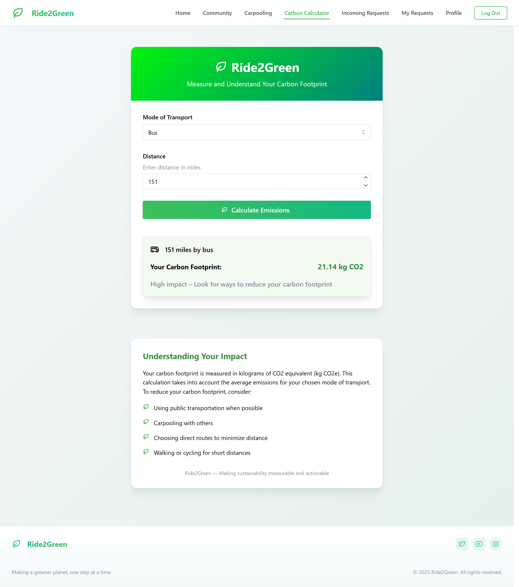

  
    

## Table of Contents
- [💡 Problem Statement & Solution](#-problem-statement--solution)
- [📽️ Visit Us](#-visit-us)
- [🚀 Getting Started](#-getting-started)
- [🧰 Resources](#-resources)
- [🖼️ Screenshots](#-screenshots)
- [⚙️ Key Features](#-key-features)
- [🌟 Additional Features](#-additional-features)
- [🖥️ Architecture & Tech Stack](#-architecture--tech-stack)
- [💡 Problem Statement & Solution](#-problem-statement--solution)
- [📽️ Visit Us](#-visit-us)
- [🚀 Getting Started](#-getting-started)
- [🧰 Resources](#-resources)
- [🖼️ Screenshots](#-screenshots)
- [⚙️ Key Features](#-key-features)
- [🌟 Additional Features](#-additional-features)
- [🖥️ Architecture & Tech Stack](#-architecture--tech-stack)

---

## 💡 Problem Statement & Solution

### Problem Statement
With increasing concerns over climate change and rising carbon emissions, there's an urgent need for innovative solutions that promote sustainable transportation and community awareness. Most existing systems lack real-time, user-friendly features that help individuals calculate, compare, and reduce their carbon footprint effectively.

### Solution
Ride2Green is a smart web application designed to promote eco-friendly commuting. By integrating a carbon footprint calculator, real-time community interaction, and a carpooling solution, the platform encourages sustainable practices while fostering a green-minded community.
Users can calculate their transportation emissions, share eco-friendly lifestyle tips, and coordinate carpools efficiently. Ride2Green simplifies green commuting while building a connected, environmentally conscious user base.

---

## 📽️ Visit Us

### 🔗 [Live App - Vercel](https://eco-commute-seven.vercel.app/)

---

## 🚀 Getting Started
Before running the project, make sure you have the necessary files downloaded:
1. **API keys**: Set up required API keys for Firebase and OpenStreetMap API key.
2. **Firebase**: Ensure the Firebase project is set up and the necessary credentials are configured in your React app.

Note : This project requires a Firebase API key; please **create your own API key** to use the project.

---

## 🧰 Resources

- 🌿 [Mantine UI](https://mantine.dev/) - Modern React UI library for clean and responsive components.
- 🔥 [Firebase Docs](https://firebase.google.com/docs) - Auth, Firestore DB, and Storage for backend.
- 🗺️ [OpenStreetMap API](https://www.openstreetmap.org/) - For map rendering and route visualization.
- 🚀 [Vercel](https://vercel.com/) - Hosting and deployment platform for the frontend.

---

## 🖼️ Screenshots

<pre>

</pre>

---

## ⚙️ Key Features

1. 🧮 **Carbon Calculator**
- Allows users to input their mode of transport and trip details.
- Calculates and displays carbon emissions.
- Provides eco-friendly alternatives.

2. 👥 **Community**
- Real-time content sharing using Firebase Firestore.
- Users can post eco-living tips or updates.
- Like and comment system for posts.
- Fosters interaction and motivation within eco-conscious users.

3. 🚘 **Car Pooling**
- Users can create a journey specifying source, destination, time, date, and seats.
- Matches are displayed if existing trips align.
- If no match, a new trip is created.
- Requests are shown on a dedicated Requests page with accepted/rejected status.
- OpenStreetMap integration displays the route visually.
- Compares carbon emissions between car, public transit, and carpooling.

---

## 🌟 Additional Features

- ✅ Real-time UI updates with Firebase.
- 🌐 Route calculation and emission comparison.
- 🔐 Secure authentication via Firebase Auth.
- 📱 Responsive UI using Mantine.
- 📊 Clean and informative carbon footprint analytics.

---

## 🖥️ Architecture & Tech Stack

1. **Frontend:**
   - React: Mantine UI Fraework
2. **Database:**
   - Firebase Auth: Authentication
   - Firebase Firestore: NoSQL Database
   - Firebase Storage: Recipe image hosting
3. **Maps and Routing:**
   - OpenStreetMap API
4. **Hosting and Deployment:**
   - Vercel: Hosting and Deploying the Frontend

---

## Happy coding 💯

Made with love ❤️
---
